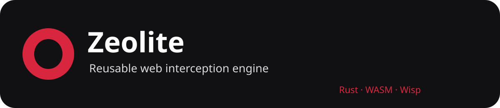

# Zeolite

**Current release: 1.0 Nitride** · Rust/WASM · Wisp v2.1
Zeolite is a standalone, reusable web interception/proxy engine providing a browser service-worker runtime, streaming rewriting, Wisp transport, diagnostics, and WebExtension compatibility.
## Current architecture
The 1.0 release is interception + rewriting. The rewriter is production code.
    Host application -> Zeolite -> service worker -> interception/runtime -> streaming rewriter -> Wisp v2.1 -> upstream
## NativeTransit direction
NativeTransit is the next architecture: transport/interception first, with the existing rewriter retained as RewriteFallback.
    Zeolite -> Transport API -> NativeTransit
             \-> RewriteFallback -> Wisp -> Network
> Keep the website native whenever the browser architecture allows it. Rewrite only when necessary.
NativeTransit is a design direction, not a claim that the current release has already replaced rewriting. If it proves stable across serious real-world compatibility tests, rewriting can eventually become optional for integrations that do not need it.
NativeTransit reuses existing transport, cookie/session and diagnostics infrastructure. It does not add Gecko-specific architecture.
## Current capabilities
Rust/WASM streaming rewriting; Wisp v2.1; service-worker interception; bounded diagnostics; WebExtension compatibility; extension resource protection; standalone server; compatibility probes; SSRF/destination protection.
## Important limitations
Zeolite is not a full browser engine. Some WebExtension APIs, true isolated extension worlds, service-worker virtualization, virtual origins, cookie/storage behavior and advanced browser networking remain partial or planned.
## Repository layout
- crates/rewriter — Rust/WASM rewriter
- crates/wisp-core — Wisp v2.1
- crates/wisp-extensions — server extensions
- crates/zeolite-server — standalone server
- app/src/sw.ts — service worker
- app/src/extensions — WebExtension runtime
- app/src/diag.ts — diagnostics
- suite — compatibility probes
- docs — architecture/versioning/roadmap
## Diagnostics
Current bounds: 512 diagnostic events and 256 trace entries, with one trace ID per request. Secrets must be redacted.
## Development
cargo build -p zeolite-rewriter -p zeolite-wisp --target wasm32-unknown-unknown --release
cd app && npx vitest run && npm run build
cargo run -p zeolite-server -- --port 6002 --static ../app/dist
node suite/probe.mjs --base http://localhost:6002
## Roadmap
The roadmap covers interception APIs/rules, diagnostics, WebSockets, virtual origins/cookies, storage, workers/service workers, downloads/session export, fingerprinting consistency, compatibility recording/replay and final hardening.
See docs/versioning.md, docs/roadmap.md, docs/engine-adapter.md and docs/plugins.md.